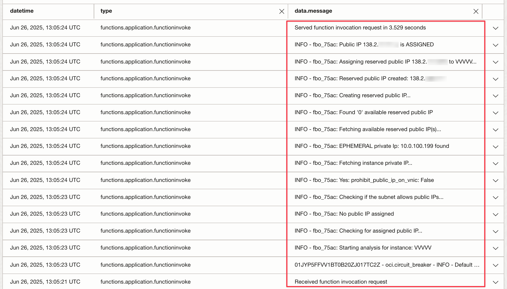

# OCI-FN_reserved_pip_allocator

**OCI-FN_reserved_pip_allocator** is an OCI Function demonstrating how to automatically apply a reserved public PIP to compute instance after launch.
This function can we use with any compute instance service, such as autoscaling group or single instances.

# Quick set up guide 

Read the step by step guide to quickly set up your environment and deploy your function to OCI:
[https://github.com/Olygo/OCI-FN_reserved_pip_allocator/raw/main/OCI_Function_QuickStart.pdf](https://github.com/Olygo/OCI-FN_reserved_pip_allocator/raw/main/OCI_Function_QuickStart.pdf)

# Function Behavior

**Trigger** 

The function starts when an OCI Event of type ***Instance - Launch End*** is received, meaning a compute instance has just completed launching.

**Step 1** Analyze IP Configuration:

The function analyzes the instance's network interfaces to determine if it has a Public IP address assigned.

**Step 2** Check if a Public IP is assigned:

	If a Public IP is assigned, the function checks the type of that IP:

		If it's a Reserved Public IP:
			-> Function does nothing and ends, no action is needed.

		If it's an Ephemeral Public IP:
			-> The script proceeds with replacing it with a Reserved Public IP:
			-> It searches in the same compartment for any available Reserved Public IP.

			If one is found, the function:
				-> Unassigns the Ephemeral Public IP from the instance.
				-> Assigns the available Reserved Public IP.

			If none are available, the function:
				-> Creates a new Reserved Public IP in the same compartment.
				-> Unassigns the Ephemeral Public IP.
				-> Assigns the newly created Reserved Public IP.

	If No Public IP is assigned:

		-> The function checks if the instance is connected to a public subnet.

			If the subnet is not public:
			-> The script does nothing and ends, there's no need to assign a Public IP.

			If the subnet is public, the script proceeds to assign a Reserved Public IP:

				-> It searches for any available Reserved Public IP in the same compartment.
				-> If one is found, it assigns it to the instance.
				-> If none are available, it:
					-> Creates a new Reserved Public IP in the same compartment.
					-> Assigns it to the instance.

## Summary of Key Decisions:

- If Reserved Public IP is already assigned → Do nothing.
- If Ephemeral Public IP is assigned → Replace with a Reserved Public IP (reuse or create).
- If no Public IP and instance is in public subnet → Assign a Reserved Public IP (reuse or create).
- If no Public IP and no public subnet → Do nothing.

# Output

## Questions ?
**_olygo.git@gmail.com_**

## Disclaimer
**Please test properly on test resources, before using it on production resources to prevent unwanted outages or unwanted bills.**
